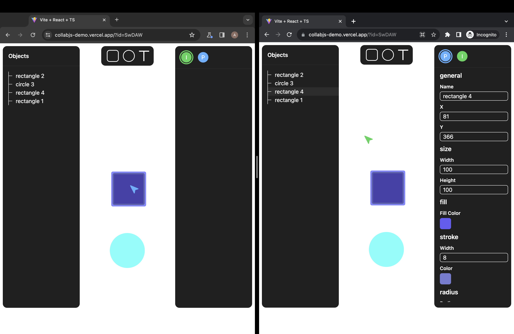

# CollabJS - Realtime Collaboration Made Easy

CollabJS is a comprehensive backend and frontend package designed to simplify the development of real-time collaboration applications. Powered by the Yjs (CRDT - Conflict-free replicated data type) framework, CollabJS is fully written in TypeScript and offers a range of tools to streamline your collaborative app development process.

## Demo


Check out our demo app [here](https://collabjs-demo.vercel.app/).

## Installation

To get started with CollabJS in your project, you can install the React library like so:

```bash
npm install @collabjs/react
```

For the backend with LevelDB support:

```bash
npm install @collabjs/core
```

## Usage

### React Components and Hooks

To use CollabJS in your React application, wrap your components with the `RoomProvider` and configure it with the necessary options:

```jsx
import React from 'react';
import { RoomProvider } from '@collabjs/react';

const App = () => {
  return (
    <RoomProvider id='room-id'
      config={{
        url: "wss://localhost:3000",
        auth: {
          token: "..."
        }
      }}
      storage={{
        todos: []
      }}
    >
      {/* Your components here */}
    </RoomProvider>
  );
};

export default App;
```

#### Hooks and APIs

CollabJS provides various hooks and APIs to interact with your real-time data:

- `useRoom`: Access room information, Yjs doc instance, and more.
- `useStorage`: Store real-time data and access it, triggering component re-renders on updates.
- `useStaticStorage`: Similar to `useStorage` but without triggering re-renders.
- `useClients`: Retrieve information about online clients (excluding yourself).
- `useSelf`: Get the current client's data and a function to update it.
- `useIsConnected`: Check the connection status (boolean).
- `useIsSynced`: Check the sync status (boolean).

Example usage:

```jsx
import React from 'react';
import { useStorage, useClients, useSelf, useIsConnected, useIsSynced } from '@collabjs/react';

const MyComponent = () => {
  const [count, update] = useStorage(data => data);

  // Update data
  update(draft => {
    draft.count++;
  });

  const { clients } = useClients();
  const [data, updateData] = useSelf();
  const isConnected = useIsConnected();
  const isSynced = useIsSynced();

  // Your component logic here
};
```

### Backend with LevelDB

To use the core package of CollabJS with LevelDB support in your Node.js project, install it like this:

```bash
npm install @collabjs/core
```

#### Example

```javascript
import express from 'express';
import { Server } from 'socket.io';
import http from "http"
import { CollabCore, LevelDbProvider, PocketbaseProvider } from '@collabjs/core';

const app = express();
const server = http.createServer(app);

// Set up your Express app here

const lvldb = new LevelDbProvider('./level-storage');
const pbdb = new PocketbaseProvider({
  url: "http://127.0.0.1:8090",
  admin: {
    email: "...",
    password: "..."
  }
});

const io = new Server(server);
const collab = new CollabCore(io, {
  db: lvldb, // Use LevelDB for storage
  authenticate: (handshake) => {
    // Authenticate the client based on the provided token
    return new Promise(resolve => {
      if (handshake.auth.token === "valid-token") {
        resolve("edit"); // Grant edit access
      } else {
        resolve("view"); // Grant view-only access
      }
    });
  },
});

collab.registerEvents({
  onClientJoined(roomName, doc, socket) {
    console.log(`Client ${socket.id} joined room ${roomName}`)
  },
  onClientLeft(roomName, doc, socket) {
    console.log(`Client ${socket.id} left room ${roomName}`)
  },
});

// Execute initialize method
collab.initialize();

server.listen(3000, () => {
  console.log('Application started on port 3000!');
});
```

## Supported Backends

CollabJS currently supports two backend data providers:

- LevelDB
- Pocketbase

## Acknowledgments

CollabJS wouldn't be possible without the following repositories:

- [Yjs](https://github.com/yjs/yjs)
- [Y-Socket.io](https://github.com/ivan-topp/y-socket.io)
- [Immer-Yjs](https://github.com/sep2/immer-yjs)
- [Y-LevelDB](https://github.com/yjs/y-leveldb)
- [Pocketbase](https://github.com/pocketbase/pocketbase)

## License

CollabJS is released under the MIT License. Feel free to use it in your projects and customize it to your needs.

Happy coding with CollabJS! 🚀